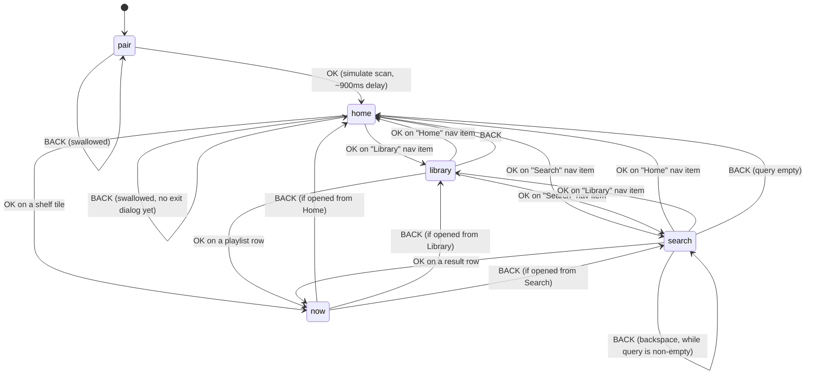

# AppleTune TV — Storyboard

Audience: the human project owner (developer). Read this to understand what
the `public/tv/` prototype actually does, screen by screen, without reading
the code.

AppleTune TV is a D-pad-only television front end for Apple Music: pair once
with a phone-scanned code, then browse and "play" a fake catalogue across
five screens. This document walks through the current prototype
(`public/tv/index.html` + `scripts/app.js`), not the full target spec in
`NAVIGATION_MODEL.md` — differences are called out where they exist.

---

## The 60-second walkthrough

1. TV boots to the **Pairing** screen, showing a QR code and the code `TV-8X29`.
2. User points a phone at the code (simulated) and presses **OK** on the remote.
3. Status line changes to "Connected. Signing you in…".
4. After ~1 second the TV lands on **Home**, greeted with "Good evening" and
   four shelves of releases; a mini-player at the bottom already shows
   "Neon Harbour" by Yuen Kwok, paused.
5. User presses **DOWN** to move focus from the nav bar into the "Recently
   Played" shelf, then **RIGHT** a few times to browse tiles.
6. User presses **OK** on a tile ("Glass Arcade" by Nova Pike).
7. The screen crossfades to **Now Playing**: art, title, artist, album, and a
   progress bar start filling in real time.
8. User presses **BACK**, returning to Home with focus restored on the tile
   they came from; the mini-player now reflects the new track.
9. Music keeps "playing" the whole time — pressing BACK never stops it.

---

## Screen: Pairing / QR

**Purpose:** Get the TV out of the "who are you" state with the least typing possible.

```
┌────────────────────────────────────────────────────────────────────────┐
│                                                                        │
│  Sign in with your phone                        ┌──────────────────┐  │
│                                                   │ ▪▪▪░░▪▪  ░▪░▪▪░  │  │
│  Scan to connect                                 │ ▪░░▪░  ▪▪▪░░▪░░  │  │
│  Apple Music                                     │ ▪░▪▪░▪░  ░▪▪░▪▪  │  │
│                                                   │  ░▪░░▪▪▪░▪░░▪░   │  │
│  1  Point your phone camera at the code.         │ ▪▪░░  ▪░▪▪░░▪▪░  │  │
│                                                   │ ░▪▪░▪▪░░  ▪░░▪▪  │  │
│  2  Or open appletune.tv/activate                │ ▪░░▪▪░▪▪░▪▪░░░▪  │  │
│                                                   │  ▪▪░░▪░░▪▪░▪░▪   │  │
│  3  Enter TV-8X29                                └──────────────────┘  │
│                                                   Expires in 9:58       │
│  ● Waiting for your phone…                                             │
│                                                                        │
│                                                                        │
│                                                                        │
│                                                                        │
│                                                                        │
│                                                                        │
│                                                                        │
│  [OK] Simulate a successful scan                                       │
└────────────────────────────────────────────────────────────────────────┘
```

**What the user can do here**

| Remote key | What happens |
|---|---|
| OK (or Enter on a keyboard) | Fires `completePairing()` regardless of where focus is — this screen has no focusable targets. Status flips to "Connected. Signing you in…", then after 900 ms the app loads track `r1` ("Neon Harbour"), paused, and shows Home. |
| Any other key | No effect. |

**Focus on entry:** none — the QR card is not a `focusable` element in this build (unlike the `NAVIGATION_MODEL.md` target, which calls for a no-op-focusable QR card so a focus ring always exists).
**BACK:** swallowed. There is nowhere to go back to and no exit-confirm dialog implemented yet.

**Notes**
- The QR bitmap is drawn deterministically from the pairing code (`drawQrPlaceholder`) purely so the layout has the right visual weight — **it is not a scannable QR code**.
- The expiry countdown (`pair-expiry`, starts at `9:58`) ticks down every second but nothing happens when it reaches zero — expiry handling is unimplemented.
- Auth itself is out of scope for this file — see `public/CLAUDE.md`'s "auth surface" rules on `activate.html`, the real page that will do the actual `music.authorize()` call.

---

## Screen: Home

**Purpose:** Root screen — browse the catalogue and see what's currently loaded.

```
┌────────────────────────────────────────────────────────────────────────┐
│ AppleTune   Home   Library   Search                    Good evening    │
│                                                                        │
│ Recently Played                                                        │
│ ┌────────┐ ┌────────┐ ┌────────┐ ┌────────┐ ┌────────┐                │
│ │Neon    │ │Glass   │ │Mango   │ │Slow    │ │Static  │  ···           │
│ │Harbour │ │Arcade  │ │Season  │ │Tide    │ │Bloom   │                │
│ │Yuen    │ │Nova    │ │Priya   │ │Marisol │ │Marisol │                │
│ │Kwok    │ │Pike    │ │Rao     │ │Vane    │ │Vane    │                │
│ └────────┘ └────────┘ └────────┘ └────────┘ └────────┘                │
│                                                                        │
│ Made For You                                                           │
│ ┌────────┐ ┌────────┐ ┌────────┐ ┌────────┐ ┌────────┐                │
│ │Paper   │ │Analog  │ │Night   │ │Cold    │ │Sunroom │  ···           │
│ │Lanterns│ │Ghosts  │ │Bus     │ │Open    │ │        │                │
│ └────────┘ └────────┘ └────────┘ └────────┘ └────────┘                │
│                                                                        │
│ Your Library                          New Releases                    │
│  (scrolls into view on DOWN — same row layout)                        │
│                                                                        │
│ ┌────┐  Glass Arcade                              Press ▶ for         │
│ │art │  Nova Pike                                 Now Playing         │
│ └────┘                                                                │
└────────────────────────────────────────────────────────────────────────┘
```

**What the user can do here**

| Remote key | What happens |
|---|---|
| ▲ ▼ | Move focus between nav bar and shelf rows. |
| ◀ ▶ | Move focus between tiles within a shelf; the row shifts via `translate3d`, keeping one tile of context to the left. |
| OK on "Library" / "Search" | Goes to that screen. |
| OK on a tile | Plays that release from track 1 and goes to Now Playing. |
| BACK | Swallowed — stays on Home. |

**Focus on entry:** first tile of the "Recently Played" shelf (`ENTRY_FOCUS.home`).
**BACK:** consumed, never exits. The `NAVIGATION_MODEL.md` target spec calls for an "Exit AppleTune?" confirm dialog here (`SX`); the prototype's own code comment says as much but the dialog is not built yet.

**Notes**
- The mini-player at the bottom only ever reflects the *last-played* track, not a queue — it's driven by the same `renderNowPlaying()` call Now Playing uses.
- Shelf and tile content all comes from `scripts/demo-data.js` — 12 fictional releases reused across four shelves (`Recently Played`, `Made For You`, `Your Library`, `New Releases`), so the same album can legitimately appear twice on screen.

---

## Screen: Now Playing

**Purpose:** Full-screen player for whatever is currently loaded.

```
┌────────────────────────────────────────────────────────────────────────┐
│  ░░░░░░░░░░░░░░░░░░░░  (soft radial "bloom" tinted by release accent)  │
│                                                                        │
│              ╭──────────╮                                              │
│             ╱            ╲          Playing from Recently Played       │
│            │   ┌──────┐   │                                            │
│            │   │ art  │   │         Glass Arcade                       │
│            │   └──────┘   │         Nova Pike                          │
│             ╲            ╱          Glass Arcade · 2024                │
│              ╰──────────╯                                              │
│                                                                        │
│                                                                        │
│                   1:07 ▬▬▬▬▬▬▬▬▬▬▬▬░░░░░░░░░░░░░░░░ 3:45               │
│                                                                        │
│                          ⏮        ⏸        ⏭                          │
│                                                                        │
│                                                                        │
│  [BACK] Return to Home        [◀ ▶] Previous / Next    [OK] Play/Pause│
└────────────────────────────────────────────────────────────────────────┘
```

**What the user can do here**

| Remote key | What happens |
|---|---|
| ◀ / ▶ (on transport row) | Move focus between ⏮ / ⏸⏵ / ⏭. |
| OK on ⏸⏵ | Toggles `app.playing`; the icon and `data-playing` attribute flip. |
| OK on ⏮ / ⏭ | `skip(-1)` / `skip(1)` — wraps around the release's track list, resets elapsed time to 0. |
| Hardware media keys (play/pause/next/prev) | Work from any screen via the `spatialmedia` event, not just here. |
| BACK | Returns to whichever screen opened it (history pop), **playback is not stopped**. |

**Focus on entry:** the play/pause button (`ENTRY_FOCUS.now`).
**BACK:** pops `app.history` and shows the previous screen (Home, Library, or Search) with that screen's remembered focus. Music keeps running in the background — there is no "stop" action anywhere in the prototype.

**Notes**
- Progress advances via a single `setInterval` ticking once per second, not real playback time; a real build would read MusicKit's `playbackTime` instead, per the code comment in `app.js`.
- `--art-accent` is set from the release's hard-coded `accent` hex on every track change — this is the prototype stand-in for the real app's per-track ambient palette (see "What changes" below).
- Album art is a two-stop CSS gradient (`accent` → `second`), never an image — see `demo-data.js`.

---

## Screen: Library

**Purpose:** Browse the user's saved playlists.

```
┌────────────────────────────────────────────────────────────────────────┐
│ AppleTune   Home   Library   Search                                    │
│                                                                        │
│  ┌──────────┐                                                          │
│  │          │   Your Playlists                                        │
│  │  art     │   6 playlists                                           │
│  │          │                                                          │
│  └──────────┘                                                          │
│                                                                        │
│  1   Late Night Drive                                    42 songs     │
│  2   Kitchen Sunday                                       28 songs     │
│  3   Focus, No Words                                       61 songs    │
│  4   Cantopop Forever                                      87 songs    │
│  5   Rainy Window                                           35 songs    │
│  6   Gym, Reluctantly                                       24 songs    │
│                                                                        │
│                                                                        │
│                                                                        │
│                                                                        │
│                                                                        │
└────────────────────────────────────────────────────────────────────────┘
```

**What the user can do here**

| Remote key | What happens |
|---|---|
| ▲ ▼ | Move focus between nav bar and playlist rows. |
| OK on a playlist row | **Does not open the playlist.** It maps the row's position onto a distinct release from the "Your Library" shelf and jumps straight to Now Playing — a known prototype shortcut, see Notes. |
| OK on "Home" / "Search" | Goes to that screen. |
| BACK | Returns to Home (pops history). |

**Focus on entry:** the first playlist row (`ENTRY_FOCUS.library`).
**BACK:** pops `app.history`, normally landing on Home.

**Notes**
- The `playlist` action in `app.js` is explicitly a stand-in: the code comment says the real app opens a track-list detail screen first (reusing the same `.list` component this screen already uses), but the prototype skips straight to playback so the Now Playing screen gets exercised from every entry point. Each of the six playlists maps to a different "Your Library" release, so review doesn't see the same track land on every row:

  | Playlist | Plays |
  |---|---|
  | Late Night Drive | Golden Hour Radio |
  | Kitchen Sunday | Harbour Lights |
  | Focus, No Words | Slow Tide |
  | Cantopop Forever | Sunroom |
  | Rainy Window | Neon Harbour |
  | Gym, Reluctantly | Paper Lanterns |
- The hero art tile is a gradient blended from the accents of playlists 1 and 4 — cosmetic only, not tied to what's playing.

---

## Screen: Search

**Purpose:** Find a release by title or artist using only a D-pad.

```
┌────────────────────────────────────────────────────────────────────────┐
│ AppleTune   Home   Library   Search                                    │
│                                                                        │
│  ▏                                    Type to search your library      │
│                                        and the Apple Music catalogue.  │
│  ┌──┬──┬──┬──┬──┬──┐                                                   │
│  │A │B │C │D │E │F │                                                   │
│  ├──┼──┼──┼──┼──┼──┤                                                   │
│  │G │H │I │J │K │L │                                                   │
│  ├──┼──┼──┼──┼──┼──┤                                                   │
│  │M │N │O │P │Q │R │                                                   │
│  ├──┼──┼──┼──┼──┼──┤                                                   │
│  │S │T │U │V │W │X │                                                   │
│  ├──┼──┼──┼──┼──┼──┤                                                   │
│  │Y │Z │0 │1 │2 │3 │                                                   │
│  ├──┼──┼──┼──┼──┼──┤                                                   │
│  │4 │5 │6 │7 │8 │9 │                                                   │
│  ├──┴──┼──┴──┴──┴──┤                                                   │
│  │SPACE│  DELETE   │                                                   │
│  └─────┴───────────┘                                                   │
└────────────────────────────────────────────────────────────────────────┘
```

**What the user can do here**

| Remote key | What happens |
|---|---|
| Arrow keys | Move focus around the 6-wide letter/number grid. |
| OK on a letter/number key | Appends that character to the query and re-filters live. |
| OK on SPACE / DELETE | Appends a space / removes the last character. |
| OK on a result row | Plays that release and goes to Now Playing (same `open` action as a Home tile). |
| BACK | Deletes the last character of the query while the query is non-empty. Once the query is empty, BACK returns to Home (pops history). |

**Focus on entry:** the first keyboard key, `A` (`ENTRY_FOCUS.search`).
**BACK:** while `app.query` is non-empty, deletes its last character and stays on Search (matches `NAVIGATION_MODEL.md` §2 — "BACK *is* backspace"). Only once the query is empty does BACK pop `app.history` and leave the screen, normally landing on Home. Character deletion is also reachable via the on-screen DELETE key.

**Notes**
- Matching is a case-insensitive substring match against `"${title} ${artist}"`, deduplicated across the Recently Played, Made For You, and New Releases shelves — which together cover all 12 demo releases, so nothing in the catalogue is unreachable from Search.
- There is no on-screen microphone/voice option; `docs/decisions/VOTE-002` is cited in the code comment as the reason the grid keyboard is the chosen approach.

---

## The state machine



BACK from Now Playing and Library pops `app.history` (falling back to `home` if the stack is empty); the three separate `now -->` edges above show the three screens it can actually return to in practice. BACK on Search is special-cased ahead of that: it backspaces the query while non-empty, and only falls through to the same history-pop once the query is empty.

---

## What is faked in the prototype

- **Album art** is a two-stop CSS `linear-gradient` per release (`accent` → `second`), not real artwork — see `demo-data.js`.
- **Playback** is a `setInterval` ticking once per second, not real audio. Nothing is actually playing; `app.elapsed` just counts up and wraps to the next track.
- **The QR bitmap** is a deterministic pseudo-random pattern seeded from the pairing code (`drawQrPlaceholder`), sized and finder-patterned to *look* like a QR code. **It will not scan.**
- **Pairing** is simulated: pressing OK anywhere on the Pairing screen calls `completePairing()` directly. No phone, no network call, no `pairing-server.js` round trip.
- **Search** only matches the 12 demo releases hard-coded in `demo-data.js` — there is no real or fake catalogue beyond that set.
- Opening a **playlist** doesn't open the playlist — it skips the track-list screen and plays a stand-in album from the "Your Library" shelf instead (see Library section, Notes).
- The pairing **expiry countdown** visually ticks down but does nothing at zero.
- **Exit confirmation** on Home's BACK, described in `NAVIGATION_MODEL.md` (`SX`), is not implemented — BACK is simply swallowed.

---

## What changes when it becomes the real app

| Prototype behaviour | Real behaviour | What it depends on |
|---|---|---|
| CSS gradient stand-in for album art | Real artwork image from the Apple Music API `Artwork.url` (with `{w}x{h}` substituted) | Apple Music Catalog / Library API access, an authenticated session |
| Hard-coded `accent`/`second` hex per release drives `--art-accent` | Ambient palette taken from the API's `Artwork.bgColor` and `textColor1`–`textColor4` fields — **not** client-side colour extraction from the image | Same `Artwork` object; zero extra image processing per `TV_UX_RESEARCH.md` §1 |
| `setInterval`-driven fake progress bar | Real playback position from MusicKit's `playbackTime` | **Unproven** — full-track playback on a real TV device is pending the POC-B test; see `docs/POCB_RESULT.md` for the gate result |
| OK on Pairing screen instantly "connects" | Real polling of `pairing-server.js` for phone-side authorization via `activate.html` | The auth surface rules in `public/CLAUDE.md` — any change here needs human sign-off |
| QR bitmap is a non-scanning placeholder | Real QR encoding of the activation URL + pairing code | A QR-generation library or server-rendered SVG |
| Search matches 12 local objects by substring | Real Apple Music Catalog search (and library search) via the API, server- or client-side | Network access, an authenticated developer + user token |
| Library shows 6 hard-coded playlists, OK plays an unrelated track | Real user library playlists, opening into a real track-list Detail screen | Apple Music Library API; the `S6 Detail` screen from `NAVIGATION_MODEL.md`, not yet built |
| Home BACK is swallowed with no dialog | "Leave AppleTune?" exit-confirm modal (`SX`), per `NAVIGATION_MODEL.md` §2 | Platform exit API on the target TV OS |
